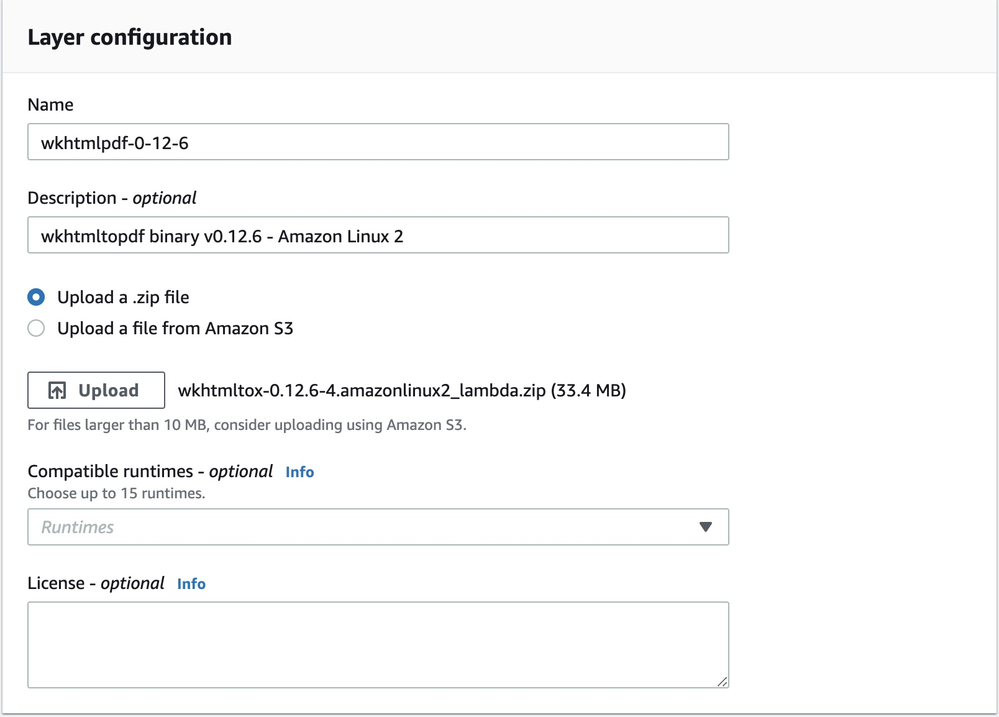
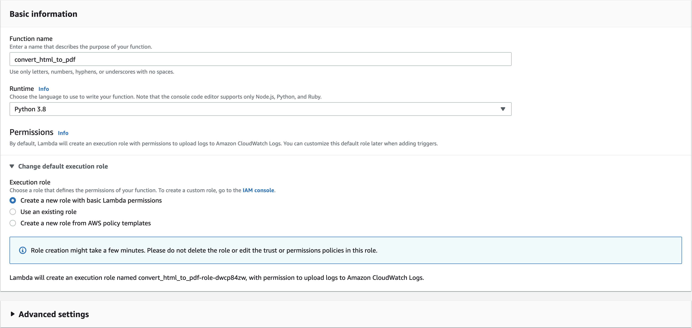

## tl;dr

### Goal
_Setting up an easy to call HTML to PDF converter as an AWS Lambda function_

### Process Overview
1. **Downloading the `wkhtmltopdf` binary**
2. **Creating the AWS Lambda layer**
3. **Writing the AWS Lambda function**
	- We will use Python's [`subprocess` module](https://docs.python.org/3/library/subprocess.html) to call the `wkhtmltopdf` command
	- For more in-depth usage, also check out [pdfkit](https://pypi.org/project/pdfkit/)
4. **Calling our function**

### Prerequisites
This article assumes access to an AWS account (free-tier is acceptable) and basic knowledge on AWS Lambda/s3. Knowledge of Python will also be assumed.

### Requirements

1. Allow passing either an s3 file key or an HTML string
2. Return a file key for the generated PDF
3. Accept a small set of options for the `wkhtmltopdf` command
	- A full man page can be found [here](https://wkhtmltopdf.org/usage/wkhtmltopdf.txt)
	- Most of the ones we'd want anyways are the default (i.e. `--images`, `--enable-external-links`, etc.)

Functionality for the following options
- `--orientation <orientation>`
- `--title <text>`
- `--margin-bottom <unitreal>`
- `--margin-left <unitreal>`
- `--margin-right <unitreal>`
- `--margin-top <unitreal>`

### Assumptions

1. The HTML string or file will be valid and will include the necessary tags (`<!DOCTYPE html>`, `<html>`, `<head>`, `<body>`)
2. The event payload will contain all valid values (s3 bucket name, file key, `wkhtmltopdf` options etc.)

### Notes
This article will use `us-east-2` for the AWS region, changing this shouldn't effect functionality, just the links within the article.

A better way to do this is through [AWS Serverless Application Model (SAM)](https://docs.aws.amazon.com/serverless-application-model/latest/developerguide/what-is-sam.html), but this is more tailored for those looking for the basic setup through the AWS Management Console.

---
A common task I've found myself undertaking recently is programatically converting an HTML file/string to an embedded and stylized PDF file.

An example use case for this might be exporting a self-managed customer invoice or generating a daily report from an existing HTML template. For those who have used template languages before, you can probably imagine the usefulness of a function like this in combination with [Jinja](https://jinja.palletsprojects.com/en/2.11.x/) or template rendering engines commonly found in Web Frameworks (like [Django](https://www.djangoproject.com/)).

After doing some research on third party libraries that could simplify our goal, I decided to use [`wkhtmltopdf`](https://wkhtmltopdf.org/).

`wkhtmltopdf` is an open-source command line tool that enables you to easy convert an HTML file to a PDF file. This is exactly what we're looking for. We will call the `wkhtmltopdf` command. For more Python driven usage, you can check out [pdfkit](https://pypi.org/project/pdfkit/).

Let's dive into it.

---

## Why AWS Lambda?
[AWS Lambda](https://aws.amazon.com/lambda/) provides serverless computing functions where you don't need to manage any servers or containers, you can simply call your function synchronously or asynchronously, and it will be executed and scaled automatically.

Lambda has a ton of use cases and is something I have personally used many times and am a big fan of.

_For our goal, AWS Lambda is a powerful tool for the following reasons_
- It allows us to offload processing away from the server
	- This is more of a general benefit, we won't actually be calling this function from a running server
	- These calls will also be scaled automatically
- Our dependencies, specifically the `wkhtmltopdf` binary, can be handled well through [AWS Lambda layers](https://docs.aws.amazon.com/lambda/latest/dg/configuration-layers.html)
	- This helps to avoid dealing with different Linux distributions or multiple installation locations

**Below is an explanation of why handling the dependencies through layers will avoid issues. For continued instruction, you can skip to the next section.**

### Issues with downloading the binary
When I was first using this library, I was also using [`pdfkit`](https://pypi.org/project/pdfkit/) to drive this interaction.  At the top of the [installation instructions, you can see the following warning:

<p style="background-color: orange; padding: 7px; text-align: center;">
<i>"<b>Warning!</b> Version in debian/ubuntu repos have reduced functionality (because it compiled without the wkhtmltopdf QT patches), such as adding outlines, headers, footers, TOC etc. To use this options you should install static binary from wkhtmltopdf site"</i>
</p>

When I first installed `wkhtmltopdf`, I didn't heed the warning and just ran the following:
```bash
sudo apt-get install wkhtmltopdf
```

On initial inspection, I wasn't experiencing the problems they mentioned (_at least in my local environment_). The issues came when I actually pushed up code using this library to a staging environment and I noticed the PDFs were no longer generating.

I was able to remedy this by installing in an alternative way:
```bash
sudo apt-get remove --purge wkhtmltopdf
wget https://github.com/wkhtmltopdf/packaging/releases/download/0.12.6-1/wkhtmltox_0.12.6-1.bionic_amd64.deb
sudo dpkg -i wkhtmltox_0.12.6-1.bionic_amd64.deb
rm wkhtmltox_0.12.6-1.bionic_amd64.deb
```

This isn't a big deal, but managing this dependency could get tedious if your architecture has multiple servers that need installed with different Linux distributions.

Putting this binary into an AWS Lambda Layer can help solve this by having a single point of installation and management.

## Downloading the `wkhtmltopdf` binary
The `wkhtmltopdf` site actually lists using this library with AWS Lambda as a [FAQ](https://wkhtmltopdf.org/downloads.html#how-do-i-use-it-in-aws-lambda) and gives the following response to this question:

_"All files required for lambda layer are packed in one zip archive (Amazon Linux 2 / lambda zip)"_

You can download the binary on the releases page under the [Stable releases](https://wkhtmltopdf.org/downloads.html#stable). You'll see an entry under `Amazon Linux` with `lambda zip` as the architecture.

Or, you can click [here](https://github.com/wkhtmltopdf/packaging/releases/download/0.12.6-4/wkhtmltox-0.12.6-4.amazonlinux2_lambda.zip) (I likely won't update this link, so probably best to go directly to the release page).

_Random note:_ If you need more fonts for future usage, I've found that [this is a good resource](https://github.com/brandonlim-hs/fonts-aws-lambda-layer).

## Creating the AWS Lambda layers

[AWS Lambda layers](https://docs.aws.amazon.com/lambda/latest/dg/configuration-layers.html) allow us to add in "layers" of dependencies for our functions. An alternative to this uploading your lambda function as a deployment package, but that is out of the scope of this post.

### `wkhtmltopdf`
Now that we have the zip file downloaded, let's add our file as a layer in the [AWS Management Console](https://us-east-2.console.aws.amazon.com/console/home?region=us-east-2).

Go to the [Layers section](https://us-east-2.console.aws.amazon.com/lambda/home?region=us-east-2#/layers) on the AWS Lambda page and click `Create layer`.

Then, add the following Layer configuration.

<div className="Image__Small">
  
</div>

Notice that we don't add a runtime here, this is intentional since our layer is a binary.

Now we're set up to start writing our function code!


## Writing the AWS Lambda function
Navigate to the [Functions page](https://us-east-2.console.aws.amazon.com/lambda/home?region=us-east-2#/functions) within the AWS Lambda service and click `Create function`.

Select `Author from scratch`, and add the following configuration.

<div className="Image__Medium">
  
</div>

You can ignore the `Advanced settings` for our use case.

Once the function is created, let's discuss a few requirements surrounding this function to give us a more clear direction, as the implementation possibilities are extensive.

### Requirements

1. Allow passing either an s3 file key or an HTML string
2. Return a file key for the generated PDF
3. Accept a small set of options for the `wkhtmltopdf` command
	- A full man page can be found [here](https://wkhtmltopdf.org/usage/wkhtmltopdf.txt)
	- Most of the ones we'd want anyways are the default (i.e. `--images`, `--enable-external-links`, etc.)

Let's allow the user to pass the following options
- `--orientation <orientation>` - the common page orientation for the PDF file.
	- Valid values are `Landscape` or `Portrait`
- `--title <text>` - the title of the generated file.
- The margins of the file
	- `--margin-bottom <unitreal>`
	- `--margin-left <unitreal>` (default is 10mm)
	- `--margin-right <unitreal>`  (default is 10mm)
	- `--margin-top <unitreal>`

### Assumptions

1. The HTML string or file will be valid and will include the necessary tags (`<!DOCTYPE html>`, `<html>`, `<head>`, `<body>`)
2. The event payload will contain all valid values (s3 bucket name, file key, `wkhtmltopdf` options etc.)

### The function code
By default, you will see the following handler.
```python
def lambda_handler(event, context):
    # TODO implement
    return {
        'statusCode': 200,
        'body': json.dumps('Hello from Lambda!')
    }
```
This is the code that will be executed when your function is called. We'll come back to this in a bit.

#### The imports
First, let's go ahead and import all of the Python libraries that we'll need and set up some basic tools like the `s3 client` and our `logger`.
```python
import json
import logging
import os
import subprocess
from typing import Optional

import boto3
from botocore.exceptions import ClientError


# Set up logging
logger = logging.getLogger()
logger.setLevel(logging.INFO)

# Get the s3 client
s3 = boto3.client('s3')
```

Now based upon our requirements, we'll likely need helper functions to
1. Potentially download an HTML file from s3
2. Upload a file to s3

Let's start with those, and then we'll return to our lambda handler.

#### Downloading/uploading the file
[`boto3`](https://boto3.amazonaws.com/v1/documentation/api/latest/index.html) makes it really easy to interact with s3.  Using `boto3`, we can add the following helper functions.

```python
def get_s3_file(bucket: str, file_key: str):
    """Downloads a file from s3 to `/tmp/[File Key]`.
    
    Args:
        bucket (str): Name of the bucket where the file lives.
        file_key (str): The file key of the file in the bucket.
    """
    local_filename = f'/tmp/{file_key}'
    s3.download_file(Bucket=bucket, Key=file_key, Filename=local_filename)
    logger.info('Downloaded HTML file to %s' % local_filename)
    
    
def upload_file_to_s3(bucket: str, filename: str) -> Optional[str]:
    """Uploads the generated PDF to s3.
    
    Args:
        bucket (str): Name of the s3 bucket to upload the PDF to.
        filename (str): Location of the file to upload to s3.
        
    Returns:
        The file key of the file in s3 if the upload was successful.
        If the upload failed, then `None` will be returned.
    """
    file_key = None
    try:
        file_key = filename.replace('/tmp', '')
        s3.upload_file(Filename=filename, Bucket=bucket, Key=file_key)
        logger.info('Successfully uploaded the PDF to %s as %s'
                    % (bucket, file_key))
    except ClientError as e:
        logger.error('Failed to upload file to s3.')
        logger.error(e)
        file_key = None
        
    return file_key
```

#### Parsing the event
One thing we haven't talked about yet is the data that we'll need to pass our function.

- `--orientation <orientation>` - the common page orientation for the PDF file.
	- Valid values are `Landscape` or `Portrait`
- `--title <text>` - the title of the generated file.
- The margins of the file
	- `--margin-bottom <unitreal>`
	- `--margin-left <unitreal>` (default is 10mm)
	- `--margin-right <unitreal>`  (default is 10mm)
	- `--margin-top <unitreal>`

Let's define our JSON event schema as the following.
```json
{
	"bucket": "<Name of the bucket> [Required]",
	"file_key": "<File key where the file is store in s3> [Optional if `html_string` is defined]",
	"html_string": "<HTML string to convert to a PDF> [Optional if `file_key` is defined]",
	"wkhtmltopdf_options": {
		"orientation": "<`Landscape` or `Portrait`> [Optional: Default is `Portrait`]",
		"title": "<Title of the PDF> [Optional]",
		"margin": "<Margin of the PDF (same format as css [<top> <right> <bottom> <left>] (all must be included)).> [Optional]"
	}
}
```
`wkhtmltopdf_options` is an optional object. If the included options are not valid, they will not be included.

We can access all of the data passed to our function from the `event` parameter in the the `lambda_handler` function.

