## tl;dr
A few of the books I've read in the past year/year and a half, the books I'm currently reading, and some books I'm looking forward to reading in the near future.

### Books I've read recently
- [Systems of Engineering Management](https://www.amazon.com/Elegant-Puzzle-Systems-Engineering-Management/dp/1732265186/ref=sxts_rp_s1_0?crid=AX7QEK5OU2PX&cv_ct_cx=systems+of+engineering+management&dchild=1&keywords=systems+of+engineering+management&pd_rd_i=1732265186&pd_rd_r=8f189fe6-5d44-4db7-9a9b-9d0abaeb4484&pd_rd_w=VxnKM&pd_rd_wg=wMDJr&pf_rd_p=c6bde456-f877-4246-800f-44405f638777&pf_rd_r=BWZ1W45ZTZA3WWT8HAT4&psc=1&qid=1628731738&sprefix=systems+of+en%2Cstripbooks%2C180&sr=1-1-f0029781-b79b-4b60-9cb0-eeda4dea34d6) by Will Larson
- [Ask Your Developer: How to Harness the Power of Software Developers and Win in the 21st Century](https://www.amazon.com/Ask-Your-Developer-Software-Developers/dp/0063018292/ref=sr_1_1?crid=3HSV1JM9NIFON&dchild=1&keywords=ask+your+developer&qid=1628731763&s=books&sprefix=ask+yourr+devel%2Cstripbooks%2C422&sr=1-1) by Jeff Lawson
- [Designing Data-Intensive Applications: The Big Ideas Behind Reliable, Scalable, and Maintainable Systems](https://www.amazon.com/Designing-Data-Intensive-Applications-Reliable-Maintainable/dp/1449373321/ref=sr_1_3?crid=3J1G3XRNXPHRL&dchild=1&keywords=designing+data+intensive+applications&qid=1628736274&s=books&sprefix=desi%2Cstripbooks%2C191&sr=1-3) by Martin Kleppmann
- [Advance: The Ultimate How-To Guide For Your Career](https://www.amazon.com/Advance-Ultimate-How-Guide-Career/dp/1119641772/ref=sr_1_1?dchild=1&keywords=advance&qid=1628731804&s=books&sr=1-1) by Gary Burnison

### Books I'm currently reading
- [Amazon Unbound: Jeff Bezos and the Invention of a Global Empire](https://www.amazon.com/Amazon-Unbound-Invention-Global-Empire/dp/1982132612/ref=sr_1_2?dchild=1&keywords=bezos&qid=1628731652&s=books&sr=1-2)
- [The Pragmatic Programmer: Your Journey To Mastery](https://www.amazon.com/Pragmatic-Programmer-journey-mastery-Anniversary/dp/0135957052/ref=sr_1_1?crid=3SDULU9KPQ7ZQ&dchild=1&keywords=pragmatic+programmer&qid=1628732011&s=books&sprefix=pragmatic%2Cstripbooks%2C174&sr=1-1) by David Thomas and Andrew Hunt
- [Zero to One: Notes on Startups, or How to Build the Future](https://www.amazon.com/Zero-One-Notes-Startups-Future/dp/0804139296/ref=sr_1_1?crid=1MUZGW6AWVHBJ&dchild=1&keywords=zero+to+one&qid=1628732171&s=books&sprefix=zero+to+%2Cstripbooks%2C177&sr=1-1) by Peter Thiel
- [Super Founders: What Data Reveals About Billion-Dollar Startups](https://www.amazon.com/Super-Founders-Reveals-Billion-Dollar-Startups/dp/1541768426/ref=sr_1_1?dchild=1&keywords=super+founders&qid=1628732312&s=books&sr=1-1) by Ali Tamaseb
- [High Growth Handbook: Scaling Startups From 10 to 10,000 People](https://www.amazon.com/High-Growth-Handbook-Elad-Gil/dp/1732265100/ref=sr_1_1?crid=R964CAGV0TSE&dchild=1&keywords=high+growth+handbook&qid=1628732228&s=books&sprefix=high+grow%2Cstripbooks%2C174&sr=1-1) by Elad Gil

### Next up
- [The Increment Bundle](https://store.increment.com/products/copy-of-the-complete-increment-bundle) published by Stripe
- [The Silmarillion](https://www.amazon.com/Silmarillion-J-R-R-Tolkien/dp/0618391118/ref=sr_1_1?crid=2P6AT5GGM31D3&dchild=1&keywords=silmarillion+hardcover&qid=1628732126&s=books&sprefix=silmarillion+%2Cstripbooks%2C178&sr=1-1) by J.R.R. Tolkien
- [Genius Makers: The Mavericks Who Brought AI to Google, Facebook, and the World](https://www.amazon.com/Genius-Makers-Mavericks-Brought-Facebook/dp/1524742678/ref=sr_1_1?crid=J2AWM39FR1MC&dchild=1&keywords=genius+makers&qid=1628732271&s=books&sprefix=genius+mak%2Cstripbooks%2C182&sr=1-1) by Cade Metz
- [Personal Finance for Tech Professionals: In Silicon Valley and Beyond](https://www.amazon.com/Personal-Finance-Tech-Professionals-Silicon/dp/1684018153/ref=sr_1_3?crid=1SJFJTZ5PY8WQ&dchild=1&keywords=personal+finance+for+tech+professionals&qid=1628732376&sprefix=personal+finance+for+tech+prof%2Cstripbooks%2C171&sr=8-3) by Bruce Barton
- [Gödel, Escher, Bach: An Eternal Golden Braid](https://www.amazon.com/G%C3%B6del-Escher-Bach-Eternal-Golden/dp/0465026567/ref=sr_1_1?crid=3ID52V8HKM2HH&dchild=1&keywords=godel+escher+bach&qid=1628732438&sprefix=godel+es%2Caps%2C189&sr=8-1) by Douglas R. Hofstadter

### Some other books I've read
- [Flash Boys: A Wall Street Revolt](https://www.amazon.com/Flash-Boys-Michael-Lewis/dp/0393244660/ref=tmm_hrd_swatch_0?_encoding=UTF8&qid=1628732637&sr=8-1) by Michael Lewis
- [The Undoing Project: A Friendship That Changed Our Minds](https://www.amazon.com/Undoing-Project-Friendship-Changed-Minds/dp/0393354776/ref=sr_1_1?crid=1AE0CNV5AW8A3&dchild=1&keywords=the+undoing+project+michael+lewis&qid=1628732585&sprefix=the+undoing+p%2Caps%2C186&sr=8-1) by Michael Lewis
- [Liar's Poker](https://www.amazon.com/Liars-Poker-Norton-Paperback-Michael/dp/039333869X/ref=sr_1_1?crid=18IL6QNJF3XQ5&dchild=1&keywords=liars+poker&qid=1628732676&sprefix=liars+po%2Caps%2C191&sr=8-1) by Michael Lewis

You can scroll to the bottom for my full future book list (not including the ones in the _Next Up_ section).

---

This by no means will be a full scale review of any books.  I may write a few sentences on what I've read or what I'm looking forward to in some of these books, but this is meant to serve as a reference for those who are interested and/or looking for something new to read.

**A number of these texts I would only recommend to those who are passionate about Software Engineering, otherwise you'll be pretty bored**.

The full book list at the bottom will have a bit more variety.

---

## Books I've read recently
Here are a few of the books I've finished up in the past year or so.

### Systems of Engineering Management by Will Larson

  
  <a href="https://images-na.ssl-images-amazon.com/images/I/71SebuRlAXL.jpg">Source</a>

[Systems of Engineering Management](https://www.amazon.com/Elegant-Puzzle-Systems-Engineering-Management/dp/1732265186/ref=sxts_rp_s1_0?crid=AX7QEK5OU2PX&cv_ct_cx=systems+of+engineering+management&dchild=1&keywords=systems+of+engineering+management&pd_rd_i=1732265186&pd_rd_r=8f189fe6-5d44-4db7-9a9b-9d0abaeb4484&pd_rd_w=VxnKM&pd_rd_wg=wMDJr&pf_rd_p=c6bde456-f877-4246-800f-44405f638777&pf_rd_r=BWZ1W45ZTZA3WWT8HAT4&psc=1&qid=1628731738&sprefix=systems+of+en%2Cstripbooks%2C180&sr=1-1-f0029781-b79b-4b60-9cb0-eeda4dea34d6) by Will Larson is an awesome primer on engineering management and describes the everyday complexities, tradeoffs, and insights learned from Will's career.

**My one regret from reading this book is not having a pen and paper to take notes the entire time**.  The inside is incredibly aesthetic and full of good content you'll want to refer back to.  This book reads more like a textbook than a narrative which means you can jump to various sections without missing too much information.

This was really my first exposure to anything engineering management related, so I may be biased, but this is a great read for early career Software Engineers looking to get into management someday; as well as, existing organization leaders.

### Ask your Developer by Jeff Lawson

  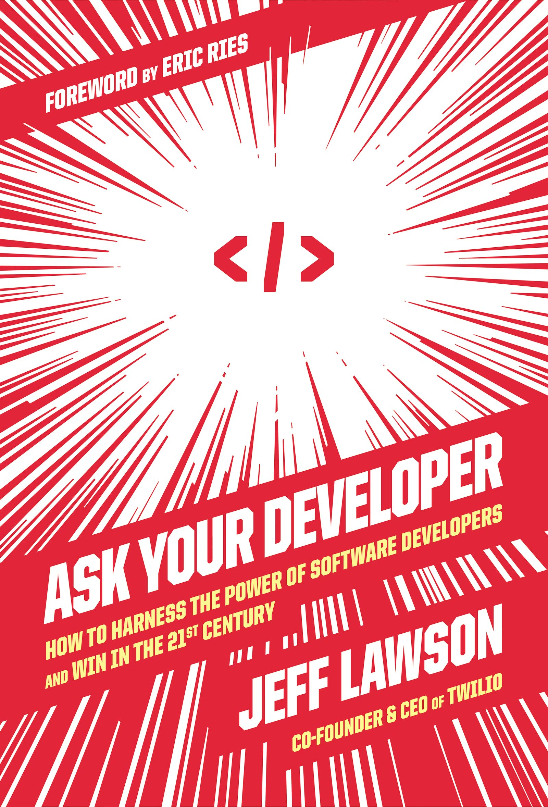
  <a href="https://images-na.ssl-images-amazon.com/images/I/91RI8Og5fhL.jpg">Source</a>

[Ask Your Developer: How to Harness the Power of Software Developers and Win in the 21st Century](https://www.amazon.com/Ask-Your-Developer-Software-Developers/dp/0063018292/ref=sr_1_1?crid=3HSV1JM9NIFON&dchild=1&keywords=ask+your+developer&qid=1628731763&s=books&sprefix=ask+yourr+devel%2Cstripbooks%2C422&sr=1-1) by Jeff Lawson is a great read by the Co-Founder & CEO of Twilio on how modern organizations can partner with and empower Software Developers to do their best work.

Jeff has experience as a Software Developer and is the current CEO of the communications giant, Twilio.  He gives a super cool perspective from his unique background on how valuable developers can be in your organization if you know how to set them up for success.  This book reads as a collection of really interesting stories used to portray Jeff's concepts and lessons.  **There are tons of gold nuggets throughout the pages** and you'll take out the notes app on your phone more than a few times.

As a developer and someone who is passionate about entrepreneurship, this book especially struck a cord with me and has been one of my favorite books on this list.  Anyone who works at a tech company or is interested in applying technology to your organization will find this valuable, but I thought it was really interesting specifically for developers and business leaders.

### Designing Data-Intensive Applications by Martin Kleppmann

  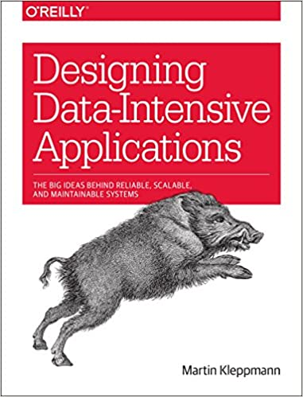
  <a href="https://images-na.ssl-images-amazon.com/images/I/51gP9mXEqWL.jpg">Source</a>

[Designing Data-Intensive Applications: The Big Ideas Behind Reliable, Scalable, and Maintainable Systems](https://www.amazon.com/Designing-Data-Intensive-Applications-Reliable-Maintainable/dp/1449373321/ref=sr_1_3?crid=3J1G3XRNXPHRL&dchild=1&keywords=designing+data+intensive+applications&qid=1628736274&s=books&sprefix=desi%2Cstripbooks%2C191&sr=1-3) by Martin Kleppmann **is a staple for software engineers** and is a treasure trove of information on building large scale and distributed applications.

The amount of information in this book is truly astounding.  It requires a loop of very focused reading, pausing, and reflecting on concepts to grasp the topics put forth.

Martin masterfully condenses incredibly complex topics and ties together theory to practice in nearly all the concepts he discusses.  If this book somehow leaves you wanting more, there is essentially a lifetime of resources to explore at the end of each chapter.

**Every Software Engineer should read this book**, especially earlier in your career.  This book opened my eyes to tons of different concepts, some I have used and wasn't aware of the background on the tools and some I will now use in my career.  Every time I picked this book up I learned something new.  That being said, it's incredibly dense, so take your time and try and truly understand the topics.

### Advance by Gary Burnison

  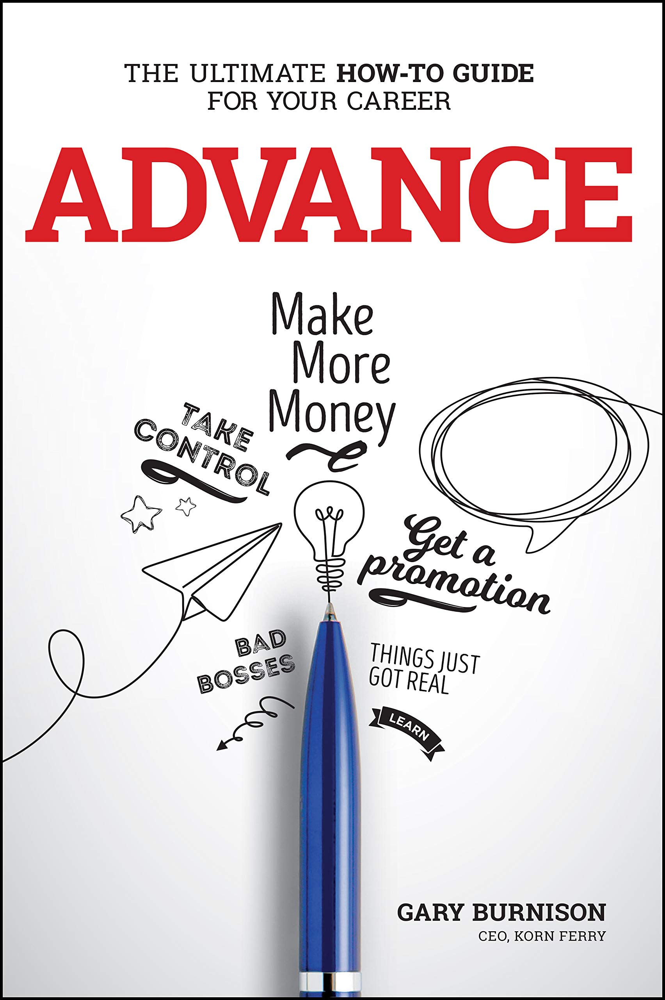
  <a href="https://images-na.ssl-images-amazon.com/images/I/81jmYCvkysL.jpg">Source</a>

[Advance: The Ultimate How-To Guide For Your Career](https://www.amazon.com/Advance-Ultimate-How-Guide-Career/dp/1119641772/ref=sr_1_1?dchild=1&keywords=advance&qid=1628731804&s=books&sr=1-1) by Gary Burnison, the CEO of Korn Ferry, is a guide on how to establish and build your career broken down into several core topics.

My initial draw to this book was flipping through the pages and seeing how aesthetic it was.  I bought it at an airport while traveling, and it was a relatively short, albeit interactive read.

There is certainly helpful advice in the pages, but overall, you wouldn't miss too much if you skipped over it.  There are interesting personality quizzes that will be a bit eye opening, but the advice is fairly general and common overall.

---

## Books I'm currently reading

### Amazon Unbound by Brad Stone

  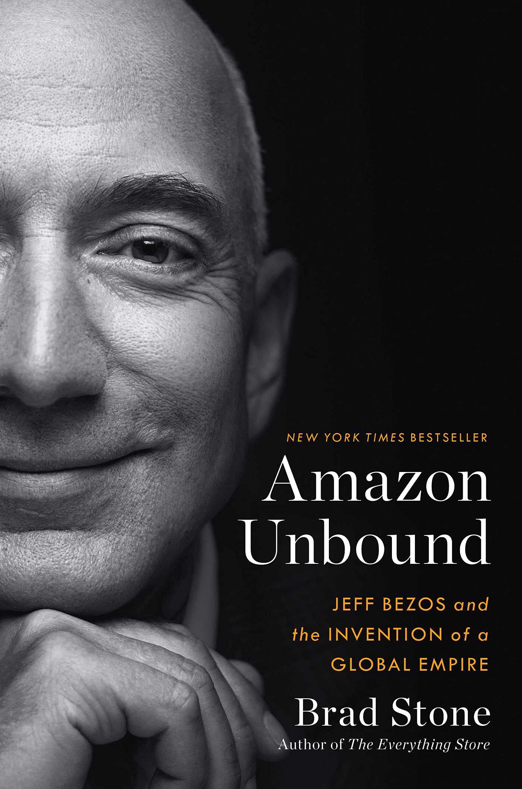
  <a href="https://images-na.ssl-images-amazon.com/images/I/7109vuubmJS.jpg">Source</a>

[Amazon Unbound: Jeff Bezos and the Invention of a Global Empire](https://www.amazon.com/Amazon-Unbound-Invention-Global-Empire/dp/1982132612/ref=sr_1_2?dchild=1&keywords=bezos&qid=1628731652&s=books&sr=1-2) by Brad Stone talks about Jeff Bezos' hand in the unprecedented growth that Amazon has experienced in the past decade.  Hearing the origin stories of AWS, Alexa, and lesser known/less successful products like the Fire Phone are incredibly telling of the culture of Amazon and the intense dedication that Bezos has.

This is a great and interesting read so far and I look forward to finishing this book up.

### The Pragmatic Programmer by David Thomas and Andrew Hunt

  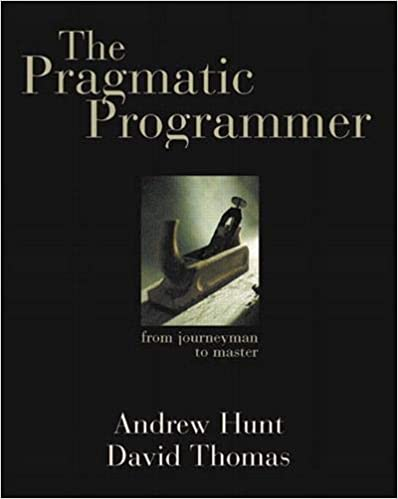
  <a href="https://images-na.ssl-images-amazon.com/images/I/41as+WafrFL.jpg">Source</a>

[The Pragmatic Programmer: Your Journey To Mastery](https://www.amazon.com/Pragmatic-Programmer-journey-mastery-Anniversary/dp/0135957052/ref=sr_1_1?crid=3SDULU9KPQ7ZQ&dchild=1&keywords=pragmatic+programmer&qid=1628732011&s=books&sprefix=pragmatic%2Cstripbooks%2C174&sr=1-1) by David Thomas and Andrew Hunt is **another classic read for Software Engineers**.  I actually started this book several years back, but never finished it up.  After finishing up _Designing Data-Intensive Applications_, I decided to jump back in and restart this book.

This book is essentially a collection of best practices, pitfall analysis, and technique explanations for a modern day programmer.  Everyone who programs should use this book as a reference guide (and hopefully it appears as a reflection) for their everyday work.

### Zero to One by Peter Thiel

  
  <a href="https://images-na.ssl-images-amazon.com/images/I/71Xygne8+qL.jpg">Source</a>

[Zero to One: Notes on Startups, or How to Build the Future](https://www.amazon.com/Zero-One-Notes-Startups-Future/dp/0804139296/ref=sr_1_1?crid=1MUZGW6AWVHBJ&dchild=1&keywords=zero+to+one&qid=1628732171&s=books&sprefix=zero+to+%2Cstripbooks%2C177&sr=1-1) by Peter Thiel explores the concepts of creating a new, unique business as opposed to competing in existing and populated markets.

I haven't made it too far into this book so I can't say much more about it, but this is a classic read for entrepreneurs or people who want a perspective from an incredibly accomplished and experienced investor and entrepreneur.

### Super Founders by Ali Tamaseb

  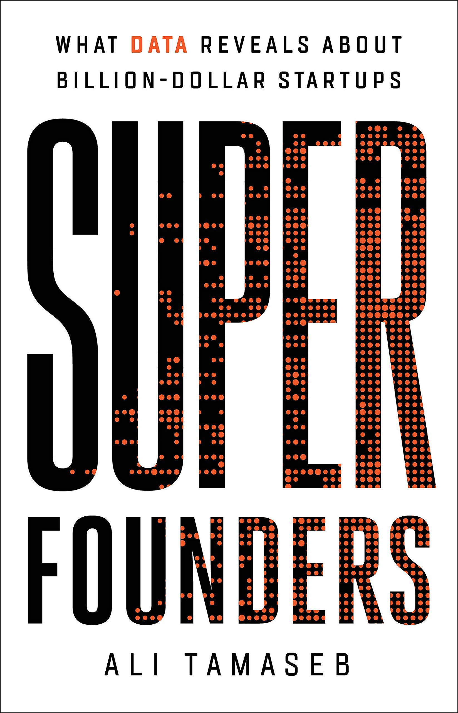
  <a href="https://images-na.ssl-images-amazon.com/images/I/812NyUH4PWL.jpg">Source</a>

[Super Founders: What Data Reveals About Billion-Dollar Startups](https://www.amazon.com/Super-Founders-Reveals-Billion-Dollar-Startups/dp/1541768426/ref=sr_1_1?dchild=1&keywords=super+founders&qid=1628732312&s=books&sr=1-1) by Ali Tamaseb explores insights that Ali has gathered from 30,000+ data points he generated from thousands of hours of research about startups, founders, and success.

_Super Founders_ is the data driven approach to analyzing traits that separate what makes a billion dollar startup from a failed/less successful startup.  There are also a number of good interviews with founders and investors of today's unicorns like Stripe, Instacart, Coinbase, and more.

I'm still in the early stages of this book but I'm looking forward to finishing this up and seeing the story the data tells.

### High Growth Handbook by Elad Gil

  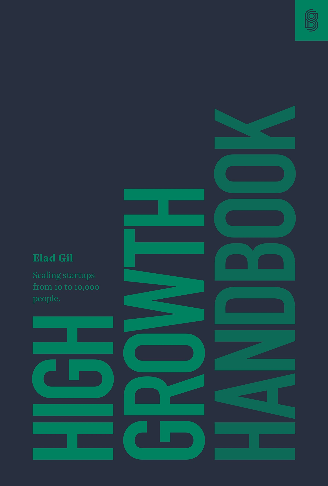
  <a href="https://images-na.ssl-images-amazon.com/images/I/71lzNMfG-5L.jpg">Source</a>

[High Growth Handbook: Scaling Startups From 10 to 10,000 People](https://www.amazon.com/High-Growth-Handbook-Elad-Gil/dp/1732265100/ref=sr_1_1?crid=R964CAGV0TSE&dchild=1&keywords=high+growth+handbook&qid=1628732228&s=books&sprefix=high+grow%2Cstripbooks%2C174&sr=1-1) by Elad Gil is described as the _"the playbook from growing your startup into a global brand"_.

I just broke into the first few pages of this book so I can't personally describe much of what it's about quite yet.  What differentiates this book is that it isn't for the typical startup, but this book's focus is on post product-market fit companies looking to scale in a big way.

## The next books in line

### The Increment Bundle from Stripe

  
  <a href="https://cdn.shopify.com/s/files/1/0092/7596/5502/products/Bundle-01_eff7b264-e3a1-4a45-b8e0-12e9d28e2778_1512x.jpg?v=1624366816">Source</a>

[The Increment Bundle](https://store.increment.com/products/copy-of-the-complete-increment-bundle) is a collection of full-color and beautifully designed software engineering magazines published by Stripe.

I have read [Issue 12: Software Architecture](https://store.increment.com/products/issue-12-software-architecture) and have a few others on my bookshelf, but I certainly want to buy the rest of the collections for it's great content and also for how awesome they look.

At the time of writing this, there are 17 issues released, and there is a new issue released every quarter.

### The Silmarillion by J.R.R. Tolkien

  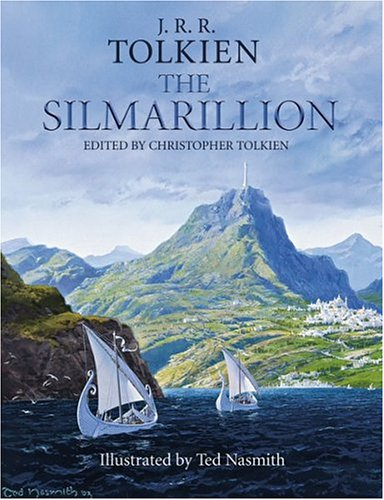
  <a href="https://images-na.ssl-images-amazon.com/images/I/51J5PMHHYFL.jpg">Source</a>

I'm a huge fan of _The Lord of the Rings_, so I'm very much looking forward to [The Silmarillion](https://www.amazon.com/Silmarillion-J-R-R-Tolkien/dp/0618391118/ref=sr_1_1?crid=2P6AT5GGM31D3&dchild=1&keywords=silmarillion+hardcover&qid=1628732126&s=books&sprefix=silmarillion+%2Cstripbooks%2C178&sr=1-1) by J.R.R. Tolkien which is described as the origin story and source for _The Lord of the Rings_ and _The Hobbit_.

I typically don't read too much fiction but I'm quite excited for it.

### Genius Makers by Cade Metz

  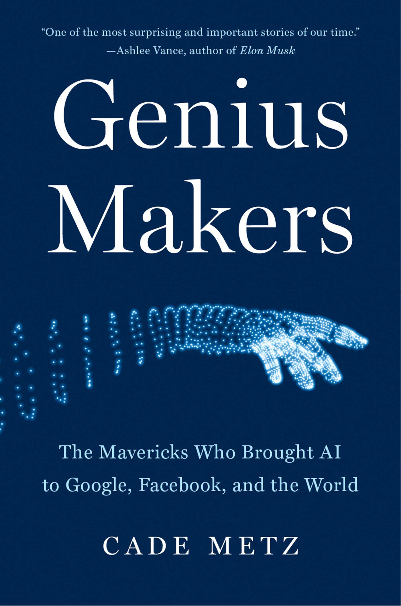
  <a href="https://images-na.ssl-images-amazon.com/images/I/71deLi-n03L.jpg">Source</a>

[Genius Makers: The Mavericks Who Brought AI to Google, Facebook, and the World](https://www.amazon.com/Genius-Makers-Mavericks-Brought-Facebook/dp/1524742678/ref=sr_1_1?crid=J2AWM39FR1MC&dchild=1&keywords=genius+makers&qid=1628732271&s=books&sprefix=genius+mak%2Cstripbooks%2C182&sr=1-1) by Cade Metz describes the modern history and evolution of AI as fueled by Silicon Valley.

### Personal Finance for Tech Professionals by Bruce Barton

  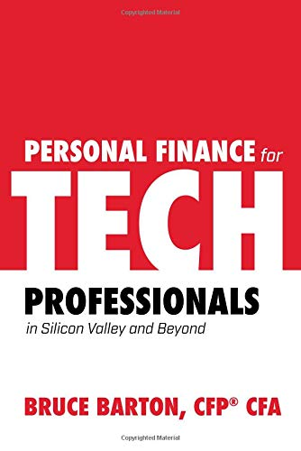
  <a href="https://images-na.ssl-images-amazon.com/images/I/41hHd5MFryL.jpg">Source</a>

[Personal Finance for Tech Professionals: In Silicon Valley and Beyond](https://www.amazon.com/Personal-Finance-Tech-Professionals-Silicon/dp/1684018153/ref=sr_1_3?crid=1SJFJTZ5PY8WQ&dchild=1&keywords=personal+finance+for+tech+professionals&qid=1628732376&sprefix=personal+finance+for+tech+prof%2Cstripbooks%2C171&sr=8-3) by Bruce Barton describes itself pretty well in the title.  Based on the reviews, this is a great resource for young engineers starting out to help navigate concepts like stock-based compensation, retirement planning, investment strategies and more.

### Gödel, Escher, Bach by Douglas R. Hofstadter

  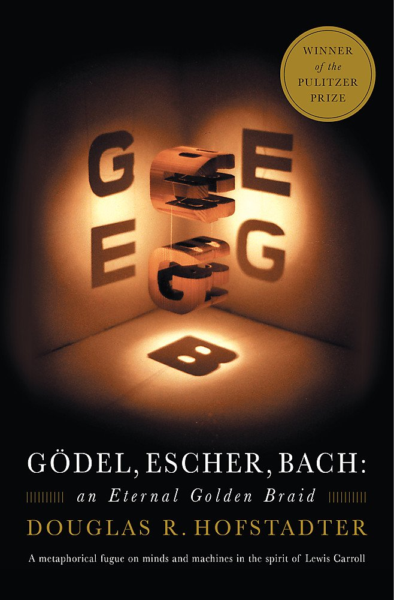
  <a href="https://images-na.ssl-images-amazon.com/images/I/61x9qySMjzL.jpg">Source</a>

[Gödel, Escher, Bach: An Eternal Golden Braid](https://www.amazon.com/G%C3%B6del-Escher-Bach-Eternal-Golden/dp/0465026567/ref=sr_1_1?crid=3ID52V8HKM2HH&dchild=1&keywords=godel+escher+bach&qid=1628732438&sprefix=godel+es%2Caps%2C189&sr=8-1) by Douglas R. Hofstadter per the Amazon.com review describes _"this book looks at the surprising points of contact between the music of Bach, the artwork of Escher, and the mathematics of Gödel"_ and looks at the future of Artificial Intelligence mimicking human thought.

I've heard this book is crazy and it describes a wide range of topics.  It's going to be a beast but I'm looking forward to it.

---

## Some other books I've read
For those looking for even more, here are three Michael Lewis books that are great and classic reads for those more interested in finance, history, psychology, and tech.

### Flash Boys by Michael Lewis

  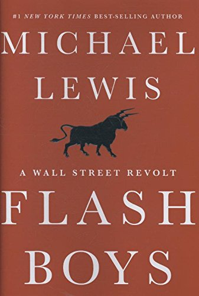
  <a href="https://images-na.ssl-images-amazon.com/images/I/41H9FWpKI4L.jpg">Source</a>

[Flash Boys: A Wall Street Revolt](https://www.amazon.com/Flash-Boys-Michael-Lewis/dp/0393244660/ref=tmm_hrd_swatch_0?_encoding=UTF8&qid=1628732637&sr=8-1) by Michael Lewis explores the story of a seemingly rigged and undefeated stock market approach by the initial players in high-frequency trading.

If you have never heard of High-Frequency Trading (HFT), this book will blow your mind with the stories and statistics.  Lewis does a fantastic job at explaining some of the concepts and how truly "rigged" HFT was at the time and the lengths that people were willing to go to win.  This has been one of my favorite books of all time, so I highly recommend giving this a read.

### The Undoing Project by Michael Lewis

  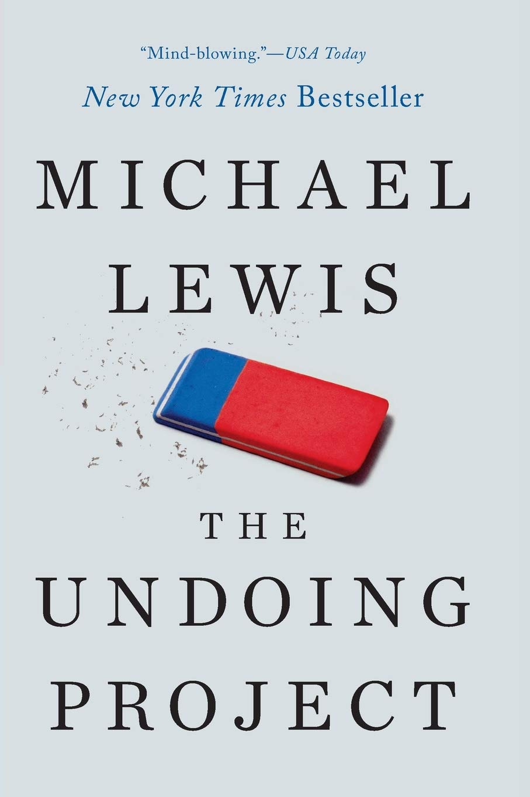
  <a href="https://images-na.ssl-images-amazon.com/images/I/61VQ0hguyXL.jpg">Source</a>

[The Undoing Project: A Friendship That Changed Our Minds](https://www.amazon.com/Undoing-Project-Friendship-Changed-Minds/dp/0393354776/ref=sr_1_1?crid=1AE0CNV5AW8A3&dchild=1&keywords=the+undoing+project+michael+lewis&qid=1628732585&sprefix=the+undoing+p%2Caps%2C186&sr=8-1) by Michael Lewis explores the story of two psychologists, Daniel Kahneman and Amos Tversky, and how they developed the field of behavioral economics.

I think just about all of the Michael Lewis books are fascinating, and this one is no different.  Great stories laid out and certain statistics that will be shocking.  Definitely a good read.

### Liar's Poker by Michael Lewis

  
  <a href="https://images-na.ssl-images-amazon.com/images/I/51LFUZmaFaL.jpg">Source</a>

[Liar's Poker](https://www.amazon.com/Liars-Poker-Norton-Paperback-Michael/dp/039333869X/ref=sr_1_1?crid=18IL6QNJF3XQ5&dchild=1&keywords=liars+poker&qid=1628732676&sprefix=liars+po%2Caps%2C191&sr=8-1) by Michael Lewis dives into the bond market in the 1980's and accounts some of Lewis' experiences at Salomon Brothers.

This is a very entertaining story by Michael Lewis and if you weren't aware of what was happening on Wall St. in the 1980's, you're in for a shocking and entertaining ride.

---

## My full future book list
Here is the current list I have on the notes app of my phone for books that I thought looked interesting when I came across them.  Without doing too much research or scraping images, I'll just post the list below (it's in no particular order).

- [The Product-Led Organization: Drive Growth By Putting Product at the Center of Your Customer Experience](https://www.amazon.com/Data-Driven-Product-Software-Customers-Without/dp/1119660874/ref=asc_df_1119660874/?tag=hyprod-20&linkCode=df0&hvadid=459680080537&hvpos=&hvnetw=g&hvrand=12119737590285172446&hvpone=&hvptwo=&hvqmt=&hvdev=c&hvdvcmdl=&hvlocint=&hvlocphy=9027248&hvtargid=pla-1012544399717&psc=1) by Todd Olson
- [The Outsiders](https://www.amazon.com/Outsiders-Unconventional-Radically-Rational-Blueprint/dp/1422162672/ref=sr_1_6?dchild=1&keywords=the+outsiders&qid=1628972455&sr=8-6) by William N. Thorndike
- [Accelerate: The Science of Lean Software and DevOps: Building and Scaling High Performing Technology Organizations](https://www.amazon.com/Accelerate-Software-Performing-Technology-Organizations/dp/1942788339/ref=sr_1_1?dchild=1&keywords=Accelerate&qid=1628972495&sr=8-1) by Nicole Forsgren, Jew Humble, Gene Kim
- [Hacking Growth: How Today's Fastest-Growing Companies Drive Breakout Success](https://www.amazon.com/Hacking-Growth-Fastest-Growing-Companies-Breakout/dp/045149721X/ref=sr_1_1?dchild=1&keywords=hacking+growth&qid=1628972543&sr=8-1) by Sean Ellis
- [Children of Dune](https://www.amazon.com/Children-Dune-Frank-Herbert/dp/0593098242/ref=sr_1_1?crid=256ZVWZ1Z7KQX&dchild=1&keywords=children+of+dune&qid=1628972584&sprefix=children+of+dune%2Caps%2C197&sr=8-1) by Frank Herbert
- [COMPLEXITY: THE EMERGING SCIENCE AT THE EDGE OF ORDER AND CHAOS](https://www.amazon.com/COMPLEXITY-EMERGING-SCIENCE-ORDER-CHAOS/dp/0671872346/ref=sr_1_2?dchild=1&keywords=Complexity&qid=1628972605&sr=8-2) by M. Mitchell Waldrop
- [Prediction Machines: The Simple Economics of Artificial Intelligence](https://www.amazon.com/Prediction-Machines-Economics-Artificial-Intelligence/dp/1633695670/ref=sr_1_1?dchild=1&keywords=prediction+machines&qid=1628972733&sr=8-1) by Ajay Agrawal, Joshua Gans, and Avi Goldfarb
- [The Essential Tversky](https://www.amazon.com/Essential-Tversky-MIT-Press/dp/0262535106/ref=sr_1_1?crid=2D1LDZPU5CVH7&dchild=1&keywords=the+essential+tversky&qid=1628972810&sprefix=the+essential+tv%2Caps%2C190&sr=8-1) by Amos Tversky
- [Essentialism: The Disciplined Pursuit of Less](https://www.amazon.com/Essentialism-Disciplined-Pursuit-Greg-McKeown/dp/0804137404/ref=sr_1_1?dchild=1&keywords=essentialism&qid=1628972832&sr=8-1) by Greg McKeown
- [Principles: Life and Work](https://www.amazon.com/Principles-Life-Work-Ray-Dalio/dp/1501124021/ref=tmm_hrd_swatch_0?_encoding=UTF8&qid=1628972880&sr=8-1-spons) by Ray Dalio
- [Blueprint: The Evolutionary Origins of a Good Society](https://www.amazon.com/Blueprint-Evolutionary-Origins-Good-Society/dp/0316230030/ref=sr_1_3?dchild=1&keywords=Blueprint+Christakis&qid=1628972926&sr=8-3) by Nicholas A. Christakis
- [Trillion Dollar Coach](https://www.amazon.com/Trillion-Dollar-Coach-Leadership-Playbook/dp/0062839268/ref=sr_1_1?dchild=1&keywords=Trillion+Dollar+Coach&qid=1628972982&sr=8-1) by Eric Schmidt, Jonathan Rosenberg, and Alan Eagle
- [Permanent Record](https://www.amazon.com/Permanent-Record-Edward-Snowden/dp/1250772907/ref=sr_1_1?dchild=1&keywords=Permanent+Record&qid=1628973096&sr=8-1) by Edward Snowden
- [The Infinite Game](https://www.amazon.com/Infinite-Game-Simon-Sinek/dp/073521350X/ref=sxts_rp_s1_0?crid=3VKO52HJZ1CYI&cv_ct_cx=the+infinite+game&dchild=1&keywords=the+infinite+game&pd_rd_i=073521350X&pd_rd_r=29e4d14c-2cc5-434d-907a-afe5d67d9f41&pd_rd_w=QmFV9&pd_rd_wg=FVaeE&pf_rd_p=c6bde456-f877-4246-800f-44405f638777&pf_rd_r=49SQR5G62QQMZXW5XS1E&psc=1&qid=1628973119&sprefix=the+infi%2Caps%2C198&sr=1-1-f0029781-b79b-4b60-9cb0-eeda4dea34d6) by Simon Sinek
- [Born to Build: How to Build a Thriving Startup, a Winning Team, New Customers and Your Best Life Imaginable](https://www.amazon.com/Born-Build-Jim-Clifton/dp/159562127X/ref=sr_1_1?dchild=1&keywords=born+to+build&qid=1628973162&s=books&sr=1-1) by Jim Clifton
- [Fooled by Randomness: The Hidden Role of Chance in Life and in the Markets](https://www.amazon.com/Fooled-Randomness-Hidden-Markets-Incerto/dp/1400067936/ref=sr_1_1?dchild=1&keywords=Fooled+by+Randomness&qid=1628973196&s=books&sr=1-1) by Nassim Nicholas Taleb
- [Emotional Intelligence: Why It Can Matter More Than IQ](https://www.amazon.com/Emotional-Intelligence-Matter-More-Than/dp/055338371X/ref=sr_1_4?crid=2K1P1YO87S459&dchild=1&keywords=emotional+intelligence&qid=1628973228&s=books&sprefix=emoti%2Cstripbooks%2C196&sr=1-4) by Daniel Goleman
- [Den of Thieves](https://www.amazon.com/Den-Thieves-James-B-Stewart/dp/067179227X/ref=sr_1_1?crid=FW1BNZSPRZUO&dchild=1&keywords=den+of+theives&qid=1628973289&s=books&sprefix=den+of+the%2Cstripbooks%2C166&sr=1-1) by James B. Stewart
- [The 48 Laws of Power](https://www.amazon.com/48-Laws-Power-Robert-Greene/dp/0140280197/ref=sr_1_3?crid=1S22PKJKLA01V&dchild=1&keywords=48+laws+of+power&qid=1628973307&s=books&sprefix=48+la%2Cstripbooks%2C174&sr=1-3) by Robert Greene
- [Stealing the Corner Office: The Winning Career Strategies They'll Never Teach You in Business School](https://www.amazon.com/Stealing-Corner-Office-Strategies-Business/dp/1601633203/ref=sr_1_1?crid=2XF8E6Y8M5VFS&dchild=1&keywords=stealing+the+corner+office&qid=1628973338&s=books&sprefix=stealing+the+cor%2Cstripbooks%2C161&sr=1-1) by Brendan Reid
- [The Man Who Solved the Market: How Jim Simons Launched the Quant Revolution](https://www.amazon.com/Man-Who-Solved-Market-Revolution/dp/073521798X/ref=sr_1_1?crid=2Q74YSJ1ACT4A&dchild=1&keywords=the+man+who+solved+the+market&qid=1628973370&s=books&sprefix=the+man+who+solved%2Cstripbooks%2C140&sr=1-1) by Gregory Zuckerman
- [Mindf*ck: Cambridge Analytica and the Plot to Break America](https://www.amazon.com/Mindf-Cambridge-Analytica-Break-America/dp/1984854631/ref=sr_1_2?crid=B4LDWFCWAXZC&dchild=1&keywords=cambridge+analytica&qid=1628973450&s=books&sprefix=cambridge+anal%2Cstripbooks%2C178&sr=1-2) by Christopher Wylie
- [Genius Foods: Become Smarter, Happier, and More Productive While Protecting Your Brain for Life](https://www.amazon.com/Genius-Foods-Smarter-Productive-Protecting/dp/0062562851/ref=sr_1_1?crid=Z417PS7WX1BF&dchild=1&keywords=genius+foods&qid=1628973469&s=books&sprefix=genius%2Cstripbooks%2C178&sr=1-1) by Max Lugavere
- [Thinking, Fast and Slow](https://www.amazon.com/Thinking-Fast-Slow-Daniel-Kahneman/dp/0374533555/ref=sr_1_2?crid=1X47VN4SYFARN&dchild=1&keywords=thinking+fast+and+slow&qid=1628973513&s=books&sprefix=thinking+fa%2Cstripbooks%2C-1&sr=1-2) by Daniel Kahneman
- [The Alchemy of Finance](https://www.amazon.com/Alchemy-Finance-George-Soros/dp/0471445495/ref=sr_1_1?dchild=1&keywords=The+Alchemy+of+Finance&qid=1628973547&s=books&sr=1-1) by George Soros
- [The Power Broker: Robert Moses and the Fall of New York](https://www.amazon.com/Power-Broker-Robert-Moses-Fall/dp/0394720245/ref=sr_1_1?dchild=1&keywords=the+power+broker&qid=1628973563&s=books&sr=1-1) by Robert A. Caro
- [Outliers: The Story of Success](https://www.amazon.com/Outliers-Story-Success-Malcolm-Gladwell/dp/0316017930/ref=sr_1_1?dchild=1&keywords=outliers&qid=1628973600&s=books&sr=1-1) by Malcolm Gladwell
- [Never Split the Difference: Negotiating As If Your Life Depended On It ](https://www.amazon.com/Never-Split-Difference-Negotiating-Depended/dp/0062407805/ref=sr_1_1?dchild=1&keywords=Never+Split+the+Difference&qid=1628973640&s=books&sr=1-1) by Chris Voss
- [Atomic Habits: An Easy & Proven Way to Build Good Habits & Break Bad Ones](https://www.amazon.com/Atomic-Habits-Proven-Build-Break/dp/0735211299/ref=sr_1_1?dchild=1&keywords=Atomic+Habits&qid=1628973667&s=books&sr=1-1) by James Clear
- [Escaping the Build Trap: How Effective Product Management Creates Real Value](https://www.amazon.com/Escaping-Build-Trap-Effective-Management/dp/149197379X/ref=sr_1_1?dchild=1&keywords=Escaping+the+Build+Trap&qid=1628973700&s=books&sr=1-1) by Melissa Perri
- [Letters to a New Developer](https://www.amazon.com/Letters-New-Developer-Starting-Development-ebook/dp/B08FD7DG94/ref=sr_1_1?dchild=1&keywords=Letters+to+a+New+Developer&qid=1628973730&s=books&sr=1-1) by Dan Moore
- [A Quantitative Primer on Investments with R](https://www.amazon.com/Quantitative-Primer-Investments-R/dp/1732235600/ref=sr_1_1?dchild=1&keywords=A+Quantitative+Primer+on+Investments+with+R&qid=1628973755&s=books&sr=1-1) by Dale Rosenthal
- [Algorithmic Trading and DMA: An introduction to direct access trading strategies unknown Edition](https://www.amazon.com/Algorithmic-Trading-DMA-introduction-strategies/dp/0956399207/ref=sr_1_3?dchild=1&keywords=Algorithmic+Trading+and+DMA&qid=1628973778&s=books&sr=1-3) by Barry Johnson
- [The Alignment Problem: Machine Learning and Human Values](https://www.amazon.com/Alignment-Problem-Machine-Learning-Values/dp/0393635821/ref=sr_1_1?dchild=1&keywords=The+alignment+problem&qid=1628973813&s=books&sr=1-1) by Brandon Christian
- [Bit Tyrants: The Political Economy of Silicon Valley](https://www.amazon.com/Bit-Tyrants-Political-Economy-Silicon/dp/1642590312/ref=sr_1_1?dchild=1&keywords=Bit+tyrants&qid=1628973844&s=books&sr=1-1) by Rob Larson
- [Thinking in Systems: A Primer](https://www.amazon.com/Thinking-Systems-Donella-H-Meadows/dp/1603580557/ref=sr_1_1?dchild=1&keywords=Thinking+in+systems&qid=1628973873&s=books&sr=1-1) by donella meadows
- [The Cold Start Problem: How to Start and Scale Network Effects](https://www.amazon.com/Cold-Start-Problem-Andrew-Chen/dp/0062969749/ref=sr_1_1?dchild=1&keywords=The+cold+start+problem&qid=1628973903&s=books&sr=1-1) by Andrew Chen
- [Calling Bullshit: The Art of Skepticism in a Data-Driven World](https://www.amazon.com/Calling-Bullshit-Skepticism-Data-Driven-World/dp/0525509208/ref=sr_1_1?crid=1G180Q9MHO4L6&dchild=1&keywords=calling+bullsht+carl+bergstrom&qid=1628973946&s=books&sprefix=calling+bul%2Cstripbooks%2C176&sr=1-1) by Carl Bergstrom
- [MAKE Book: The Indie Maker Handbook](https://makebook.io/) by Pieter Levels
- [Meditations](https://www.amazon.com/Meditations-Marcus-Aurelius/dp/195157026X/ref=sr_1_2_sspa?dchild=1&keywords=Meditations&qid=1628974118&s=books&sr=1-2-spons&psc=1&spLa=ZW5jcnlwdGVkUXVhbGlmaWVyPUEzS1kzRFJJTUc2Rlg2JmVuY3J5cHRlZElkPUEwNjgwMDU5WTgwVVlVNzJJMUhSJmVuY3J5cHRlZEFkSWQ9QTA2ODIyMjMzTVJaODlFTTZRSTVRJndpZGdldE5hbWU9c3BfYXRmJmFjdGlvbj1jbGlja1JlZGlyZWN0JmRvTm90TG9nQ2xpY2s9dHJ1ZQ==) by Marcus Aurelius
- [Start Small, Stay Small: A Developer's Guide to Launching a Startup](https://www.amazon.com/Start-Small-Stay-Developers-Launching/dp/0615373968/ref=sr_1_1?dchild=1&keywords=Start+small+stay+small&qid=1628974152&s=books&sr=1-1) by Rob Walling
- [The Startup Owner's Manual: The Step-By-Step Guide for Building a Great Company](https://www.amazon.com/Startup-Owners-Manual-Step-Step/dp/1119690684/ref=sr_1_3?dchild=1&keywords=The+Startup+Owner%E2%80%99s+Manual&qid=1628974194&s=books&sr=1-3) by Steve Blank and Bob Dorf
- [Combinators: A Centennial View](https://www.amazon.com/Combinators-Centennial-View-Stephen-Wolfram-ebook/dp/B098BQ7R6N/ref=sr_1_1?dchild=1&keywords=Combinators&qid=1628974245&s=books&sr=1-1) by Stephen Wolfram
- [The Silent Patient](https://www.amazon.com/Silent-Patient-Alex-Michaelides/dp/1250301696/ref=sr_1_1?crid=P91SSELIP56N&dchild=1&keywords=the+silent+patient&qid=1628982823&sprefix=the+silen%2Caps%2C204&sr=8-1) by Alex Michaelides

---
